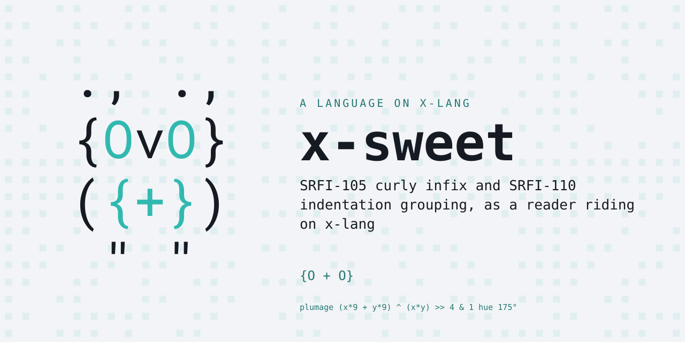
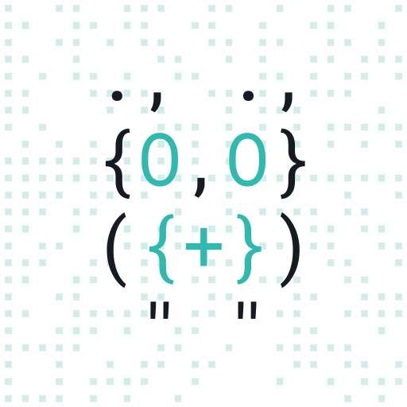

# x-sweet — sweet-expressions on x-lang

<p align="center"></p>

[SRFI-105](https://srfi.schemers.org/srfi-105/) curly infix and
[SRFI-110](https://srfi.schemers.org/srfi-110/) indentation grouping, as a
reader riding on [x-lang](https://github.com/jonruttan/x-lang).

```
$ x -l sweet
define factorial
  lambda (n)
    if {n <= 1}
      1
      {n * (factorial {n - 1})}

factorial 5
120
```

Both notations are reader-level: `{a + b}` reads as `(+ a b)`, and a line
indented under another becomes its child. Nothing is rewritten at eval time.

x-sweet is a **lang**: a different surface language loaded over an x-lang
dialect. Where x-lang and sweet spell something the same way, sweet is free to
mean something different by it. The terms are in x-lang's
[lang contract](https://github.com/jonruttan/x-lang/blob/main/docs/lang-contract.md).

## Status

**34 specs, all green** against x-lang **v0.9.0**.

Requires x-lang **v0.7.0 or later**: `sweet/ws.x` imports `x/reader/indent`,
the shared indentation stack, which exists in no earlier release.

## Install

Nothing cloned, from any directory:

```bash
x --install-lang https://github.com/jonruttan/x-sweet/releases/latest/download/lang.pin.xon
x -l sweet
```

x fetches the published pin, then the tarball it names, verifies the digest,
and installs to `<share>/langs/sweet` — where `x -l` looks. A failed upgrade
leaves the working install untouched.

From a clone, if you have one:

```bash
make install                      # into the x on your PATH
PREFIX=$HOME/.local make install  # or a particular prefix
```

`make uninstall` removes it either way. An installed x searches
`<share>/langs/*/lang.xon`, so a lang is installed when its files are there —
no registry, no database.

**One trap, and it is the one you will hit.** `x` decides where to look for
langs from the directory you run it *in*. Inside an **x-lang checkout** it
searches `deps/langs/` and an installed lang is invisible, however correctly it
was installed:

```
$ cd path/to/x-lang && x -l sweet
Error: no library, app or lang named 'sweet'
  searched lib/sweet.x, apps/sweet/run.x
      and deps/langs/*/lang.xon
```

Run it from anywhere else, or name the bundles explicitly — `X_LANG_DIR` wins
in both modes:

```bash
X_LANG_DIR=$HOME/.local/share/x/langs/ x -l sweet   # the installed one
X_LANG_DIR=/path/to/x-sweet/.. x -l sweet           # a checkout, uninstalled
```


## Pin it instead, for a project

An install is unversioned and machine-wide. When it matters *which* version a
project builds against, pin it: `Pin bundle` fetches the release tarball and
verifies it against a digest before unpacking. In the project's
`lang.pin.xon`:

```x
(lang "sweet")
(release "v0.1.2")
(bundle "sha256:…" "https://github.com/jonruttan/x-sweet/releases/download/v0.1.2/x-sweet-v0.1.2.tar.gz")
(source "https://github.com/jonruttan/x-sweet.git")
```

Each release publishes its own digest, and the release notes carry this block
ready to paste. Then:

```x-repl
> (import x/tool/pin)
> (Pin bundle "deps/langs")
"deps/langs/sweet-v0.1.2"
```

`deps/langs/` is where `x -l` looks in a checkout. `X_LANG_DIR` overrides it.

**Which to use.** Install when you just want `x -l sweet` to work. Pin when a
build depends on it — the digest is what makes the version reproducible, and
an install has none.

## Running it

```bash
x -l sweet                    # interactive
x -l sweet -f program.sweet   # batch
```

x-lang boots the dialect `lang.xon` declares, arms this bundle's module root,
and loads `run.x` on top — which is why nothing here needs to know a path.

**Mind the arm.** Everything structural has to be defined *before*
`(%sweet-arm!)` and merely called after it — see
[the rule this lang adds](#the-rule-this-lang-adds), which is the one thing
that will bite you silently.

## Development

Run the specs against any x-lang checkout or install:

```bash
X=/path/to/x-lang/x.sh make test   # the suite
make bundle                        # roll a release tarball and print its pin
```

**Pass `X` explicitly.** Without it the suite takes the `x` on your PATH, and an
installed x that trails the checkout reports failures the platform has already
fixed.

**Do not `make install` into an x-lang checkout.** The Makefile asks
`$(X) --share-dir` where to put the bundle, and a checkout answers with its own
root — so the files land in `<checkout>/langs/NAME`, which is not one of the
three paths `-l` searches there. It reports success and the lang stays
invisible. Install into a real `<share>` tree, or use `X_LANG_DIR`.

The suite runs in the spec runner's **direct mode**: the standard mode wraps
each snippet in `(begin …)`, and parentheses override indentation, so SRFI-110
cannot be tested through it. `tests/gen-harness.sh` writes the generated
harness.

The release tarball is byte-reproducible: it is built from the tag with
`git archive` and a timestamp-free gzip, so two people rolling one tag get one
digest. Pushing a `v*` tag runs the suite and, only if it is green, publishes
the tarball, its `.sha256` and `lang.pin.xon` as a GitHub release. CI runs the
declared release *and* x-lang `main`, so a platform that moves underneath this
bundle shows up as a red build rather than a surprise later.

## Layout

```
lang.xon     what this bundle is: name, dialect, release pairing
run.x               the entry -- and it knows no paths at all
sweet/ws.x          the whitespace token both SRFIs stand on
sweet/curly.x       SRFI-105
sweet/indent.x      SRFI-110
sweet/printer.x     Scheme's `write`, which is not x's
sweet/scheme.x      the eight Scheme names the specs use -- a placeholder
sweet/base.x        assembles the parts, holds the loop and the include seam
```

## The rule this lang adds

**After `(%sweet-arm!)`, the stream may contain only single-line forms.**

Arming changes how the very next character is tokenized. A multi-line form read
after that point has sentinels injected among its elements. In a body sequence
that is invisible — the sentinel is self-evaluating. In an arity-sensitive form
it is silent and fatal:

```scheme
(if (null? %r) () (%seq ...))       ; becomes
(if "mark" (null? %r) "mark" () "mark" (%seq ...))
```

which takes the wrong branch and prints nothing at all. No error, no output, a
suite that fails every test with an empty result. Everything structural —
including the read-eval-print loop — is therefore defined *before* the arm and
merely called after it.

Module loads are exempt. `include` — and `import`, which funnels through it —
suspends the sweet reader for the duration, so an included file reads exactly
as it would with sweet never armed. The suspension is a depth, not a flag, so
nested includes balance, and it resumes even if the load raises.

## Background

Sweet-expressions come from David A. Wheeler's *Readable Lisp S-expressions
Project*: the claim that Lisp can keep homoiconicity while losing the
parentheses people bounce off. The discipline that makes it more than
syntax-flavouring is that every notation is a strict generalization of
s-expressions — any ordinary s-expression is still read unchanged, and the new
forms only add meaning where none existed. Both notations were standardized as
Scheme SRFIs by Wheeler and Alan Manuel K. Gloria: curly infix in 2012,
indentation grouping in 2013.

- [Readable Lisp S-expressions Project](https://readable.sourceforge.io/) — rationale, tutorials, history
- [SRFI-105](https://srfi.schemers.org/srfi-105/) — curly-infix-expressions (2012)
- [SRFI-110](https://srfi.schemers.org/srfi-110/) — sweet-expressions (2013)

## Licence

MIT No Attribution (MIT-0). See [LICENSE](LICENSE).

<p align="center"></p>
